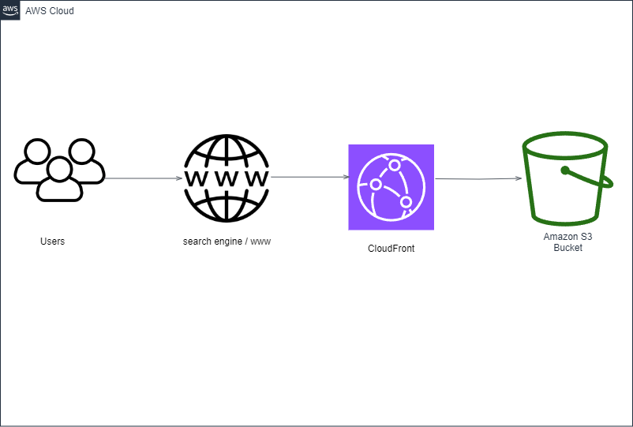

# BIZINQ_Website_Project Hosting Using AWS S3 & CloudFront

This project involves the hosting of the website using Aws Services as part of my Devops projects series.

Step 1:
An S3 bucket was created as a starting point to upload all the contents of the website to be deployed and hosted on AWS.

Step 2
Create a cloudFront Distribution and once that is completed, the bucket policy was updated on s3 to give cloudfront permission to access the bucket.

Step 3
This is the link to the cloudfront distribution to access the website
https://d1p8ldrz3m00sv.cloudfront.net/